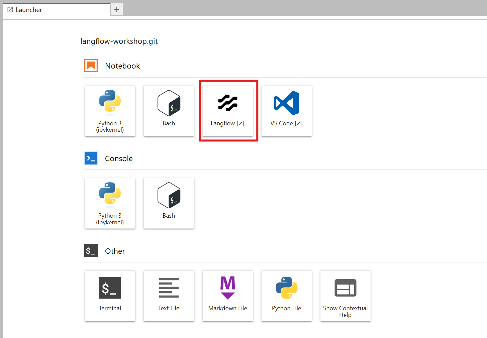
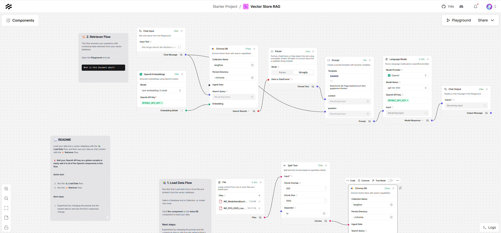
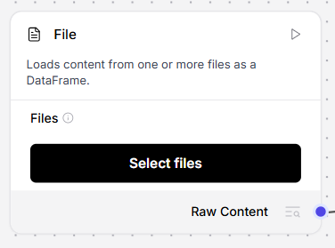

# KI mit Spickzettel: RAG verstehen und anwenden

In diesem Workshop lernen Sie, wie Sie mit Hilfe von Künstlicher Intelligenz (KI) Ausschreibungen schneller analysieren und bewerten können. Wir verwenden dazu die Retrieval-Augmented Generation (RAG) Methode, bei der ein Sprachmodell (LLM) mit externen Dokumenten kombiniert wird, um präzisere und kontextbezogenere Antworten zu generieren.

## Beispielfragen sammeln

Sammeln Sie typische Fragen, die Sie beantworten müssen, um eine Ausschreibung einzuordnen und zu entscheiden, ob Sie ein Angebot abgeben wollen. Beispiele:

- Welche Fristen gelten für die Angebotsabgabe und die Zuschlagsfrist?
- Welche Dokumente muss ich mit dem Angebot einreichen?
- Wie sind Mengenänderungen oder zusätzliche Leistungen nach VOB/B geregelt?
- Welche Regelungen gelten für Nachträge oder Nachforderungen?
- Welche Pflichten gelten für Fremdfirmen auf der Baustelle?
- Welche Vorschriften gibt es zum Thema persönliche Schutzausrüstung (PSA)?

## Umsetzung einer RAG-Pipeline mit [Langflow](https://www.langflow.org/)

Wir setzen eine RAG-Pipeline (Retrieval-Augmented Generation) mit Langflow um, um Fragen mithilfe von Dokumenten zu beantworten. Wir wollen dazu die Dokumente zur Beispielausschreibung verwenden.

### 1. Laden Sie die notwendigen Dokumente herunter

Dies sind:

- Die Ausschreibungsdokumente [`ausschreibung.zip`](./ausschreibung.zip)
- Der RAG-Prozess [`Workshop_RAG_verstehen_und_anwenden.json`](./Workshop_RAG_verstehen_und_anwenden.json)

### 1. Starten Sie Langflow

### 2. Importieren Sie den Flow `Workshop_RAG_verstehen_und_anwenden.json`

Anschließend sollte folgender Flow in Langflow angezeigt werden:

### 3. Fügen Sie die Dokumente hinzu

Sie können die weitere oben heruntergeladene ZIP-Datei `ausschreibung.zip` direkt in den entsprechenden Knoten im Flow laden.

### 4. Öffnen Sie den *Playground* und testen Sie die RAG-Pipeline mit den Fragen.
