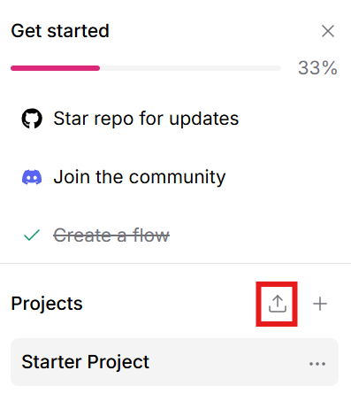

# KI mit Spickzettel: Wie macht man Wissen für LLMs zugänglich?

## Recherche mit Google oder dem [K!mpuls Chatbot](https://openai.ki.fh-swf.de)

Versuchen Sie, folgende Fragen zu beantworten:

- Wie lange dauert eine Bachelorarbeit im Studiengang Informatik?
- Welche Module unterrichtet Prof. Christian Gawron?
- Welche Module gehören zur Vertiefungsrichtung Künstliche Intelligenz?
- ... weitere Fragen zum Studiengang Informatik

## Umsetzung einer RAG-Pipeline mit [Langflow](https://www.langflow.org/)

Wir setzen eine RAG-Pipeline (Retrieval-Augmented Generation) mit Langflow um, um Fragen mithilfe von Dokumenten zu beantworten. Wir wollen dazu 

- das Modulhandbuch 
- und die Fachprüfungsordnung 

für den Studiengang Informatik verwenden.

### 1. Starten Sie Langflow

### 2. Importieren Sie den Flow `Vector Store RAG mit Chroma.json`

Anschließend sollte folgender Flow in Langflow angezeigt werden:

### 3. Fügen Sie die Dokumente hinzu

Die Dokumente finden Sie im Verzeichnis `example_docs`.

### 4. Öffnen Sie den *Playground* und testen Sie die RAG-Pipeline mit den Fragen.
